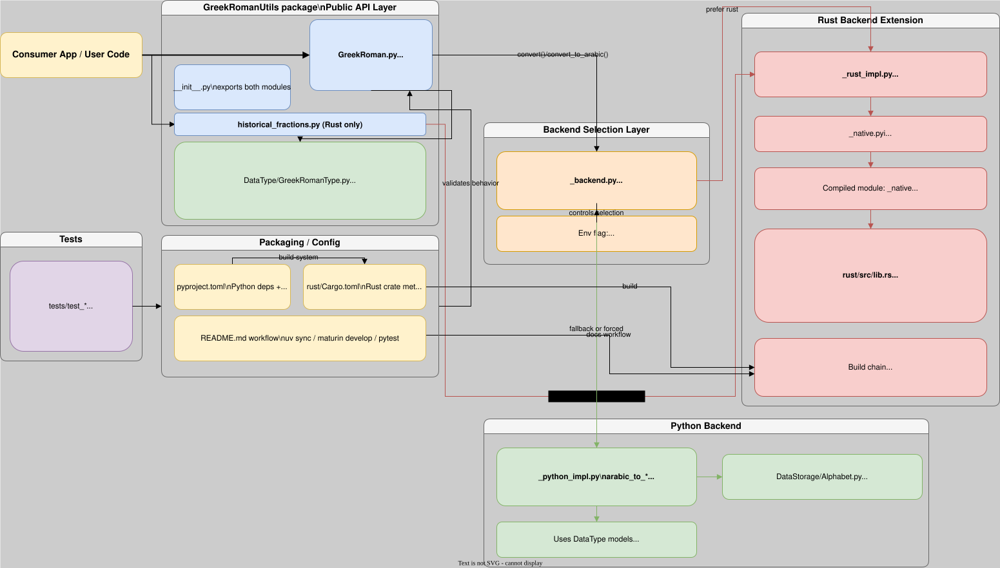

# English

## Module converting Arabic numerals to Greek and Roman numbers

**Version:** 1.2.0\
**Supported Python:** 3.11-3.14 stable; 3.15.0rc2 provisionally tested\
**Repository:** [GitHub - GreekRomanNumerical](https://github.com/PavelKotDRM/GreekRomanNumerical)  
**License:** Apache 2.0

### Description

The library converts Arabic numbers, such as `1234`, to Roman equivalents, such as `MCCXXXIV`, or Greek — `Α_ΣΛΔ`.

This module can also output Greek numbers in different formats. For example, the number `20005003001` can be represented as `Κ___Ε__Γ_Α` or `Κ~Ε~Γ~Α`. In addition, it is possible to output the text name of the digits, for example, `Kappa macron Epsilon macron Gamma macron Alpha`, or output them in lowercase.  

Finite float values use a decimal point followed by Arabic decimal digits for the fractional part, for example `1.25` becomes `I.25` or `α.25`.

### Installation

Install the package using pip:

```bash
pip install GreekRomanUtils
```

### Hybrid backend (Python + Rust)

Starting from this migration stage, the public API stays unchanged while internal conversion logic can run on a Rust backend.

- Default behavior: try Rust backend first, fallback to Python automatically.
- Force Python backend:

```bash
GREEKROMAN_FORCE_PYTHON=1
```

The Rust bridge preserves Python's arbitrary-precision integers. Output size remains limited by available memory.

### Development environment and quality checks

Requirements: Python 3.11 or newer, `uv`, and [rustup](https://rustup.rs). Windows builds also require the MSVC C++ Build Tools.

Create the environment and install the project with its Rust extension:

```bash
rustup toolchain install stable
uv python install 3.11
uv sync --locked --group dev --python 3.11
```

Install the optional notebook tools only when needed:

```bash
uv sync --locked --group dev --group notebook --python 3.11
```

Run the full test suite with the Python backend:

```bash
GREEKROMAN_FORCE_PYTHON=1 uv run pytest -v
```

On Windows PowerShell:

```powershell
$env:GREEKROMAN_FORCE_PYTHON = "1"
uv run pytest -v
Remove-Item Env:GREEKROMAN_FORCE_PYTHON
```

Rebuild the Rust extension after Rust changes and test the hybrid backend:

```bash
uv run maturin develop --manifest-path rust/Cargo.toml
uv run pytest -v
```

Run Python lint and type checks:

```bash
uv run ruff check --exclude tests/
uv run ty check --exclude tests/
```

Check Rust formatting, compile the Rust crate, and build the package:

```bash
cargo fmt --manifest-path rust/Cargo.toml --check
cargo test --locked --manifest-path rust/Cargo.toml
uv build
```

Rust behavior is currently covered by the Python backend-equivalence tests; the Rust crate has no standalone unit tests yet.

Run the opt-in performance benchmarks (the Rust extension must be built):

```bash
uv sync --locked --group dev --group performance --python 3.11
uv run maturin develop --manifest-path rust/Cargo.toml
uv run --group performance pytest benchmarks/test_backend_performance.py --benchmark-only --benchmark-sort=mean
```

The benchmark checks result equivalence before timing Roman, classic Greek, and positional Greek conversions in both backends. It reports measurements without enforcing a speed threshold because timings depend on the machine.

### The structure of the project

There are two main classes: `GreekConvert` and `RomanConvert`. They implement the logic of converting to the corresponding numbers. There are also classes `GreekAlphabet` and `RomanNumberAlphabet`, which are used to store lists and dictionaries.  
There are proprietary data types `GreekNumber` and `RomanNumber` for working with Greek and Roman numbers, which will allow you to perform basic mathematical operations with them.

### Main functions

**For "GreekConvert":**

- `change_capital` — A flag that controls the conversion of characters to upper or lower case.
- `change_positional` — Change the positional mode for conversion.
- `convert` — The function of converting an Arabic number to a Greek one, returns `GreekNumber` object. For example, the number `20005003001` is converted to `Κ___Ε__Γ_Α` (non-positional mode) or to `Κ~Ε~Γ~Α` (positional mode).
- `convert_to_arabic` — A function for converting a Greek number to an Arabic one.
- `unicode_to_name` — The function converts a Unicode character into its name.
- `name_to_unicode` — The reverse operation for `unicode_to_name`.

**The "GreekNumber" class:**

- `set_number` — Set a new value.
- `set_positional` — Set the positional mode flag (affects display format: underscore `_` for non-positional, tilde `~` for positional).
- `set_capital` — Set the upper case flag.
- `get_number` — Get the current number.
- `get_positional` — Get the positional flag value.
- `get_capital` — Get the capital flag value.
- `get_str` — Get the textual representation of the number (e.g., "alpha beta gamma").
- And basic mathematical operations (+, -, *, /, //, %, **, ==, !=, <, <=, >, >=).

**For "RomanConvert":**

- `convert` — The method converts an Arabic number to a Roman number, returns `RomanNumber` object.
- `convert_to_arabic` — The reverse method for `convert`.

**For "RomanNumber":**

- `set_number` — Set a new value.
- `get_number` — Get the current number.
- `get_value` — Get the string representation of the Roman numeral.
- And basic mathematical operations (+, -, *, /, //, %, **, ==, !=, <, <=, >, >=).

----------------------

## Ru

## Модуль преобразование арабских цифр в греческие и римские числа

**Версия:** 1.2.0\
**Поддерживаемые версии Python:** 3.11-3.14 stable; 3.15.0rc2 проверяется предварительно\
**Репозиторий:** [GitHub - GreekRomanNumerical](https://github.com/PavelKotDRM/GreekRomanNumerical)  
**Лицензия:** Apache 2.0

## Описание

Библиотека преобразует арабские числа, такие как `1234`, в римские эквиваленты, например, `MCCXXXIV`, или греческие — `Α_ΣΛΔ`.

Также этот модуль может выводить греческие цифры в разных форматах. Например, число `20005003001` можно представить как `Κ___Ε__Γ_Α` или `Κ~Ε~Γ~Α`. Кроме того, есть возможность выводить текстовое название цифр, например, `Kappa macron Epsilon macron Gamma macron Alpha`, или выводить их в нижнем регистре.

Конечные значения `float` записываются через точку, после которой идут обычные десятичные цифры дробной части: например, `1.25` преобразуется в `I.25` или `α.25`.

### Установка

Установите пакет с помощью pip:

```bash
pip install GreekRomanUtils
```

### Гибридный backend (Python + Rust)

На этапе миграции публичный API не меняется, но внутренняя логика конвертации может выполняться через Rust backend.

- Поведение по умолчанию: сначала попытка Rust backend, при недоступности автоматический fallback на Python.
- Принудительное отключение Rust backend:

```bash
GREEKROMAN_FORCE_PYTHON=1
```

Rust-мост сохраняет произвольную точность целых Python. Размер строкового результата ограничен доступной памятью.

### Настройка среды и проверки качества

Требования: Python 3.11 или новее, `uv` и [rustup](https://rustup.rs). Для сборки в Windows также нужны MSVC C++ Build Tools.

Создание окружения и установка проекта вместе с Rust-расширением:

```powershell
rustup toolchain install stable
uv python install 3.11
uv sync --locked --group dev --python 3.11
```

Дополнительные инструменты для ноутбуков устанавливаются отдельно:

```powershell
uv sync --locked --group dev --group notebook --python 3.11
```

Полный набор тестов с Python backend:

```powershell
$env:GREEKROMAN_FORCE_PYTHON = "1"
uv run pytest -v
Remove-Item Env:GREEKROMAN_FORCE_PYTHON
```

После изменений Rust пересоберите расширение и запустите тесты в hybrid-режиме:

```powershell
uv run maturin develop --manifest-path rust/Cargo.toml
uv run pytest -v
```

Проверки Python-кода:

```powershell
uv run ruff check --exclude tests/
uv run ty check --exclude tests/
```

Проверки Rust и сборка пакета:

```powershell
cargo fmt --manifest-path rust/Cargo.toml --check
cargo test --locked --manifest-path rust/Cargo.toml
uv build
```

Поведение Rust backend покрывается Python-тестами эквивалентности; отдельных Rust unit-тестов пока нет.

Запуск opt-in тестов производительности (Rust-расширение должно быть собрано):

```powershell
uv sync --locked --group dev --group performance --python 3.11
uv run maturin develop --manifest-path rust/Cargo.toml
uv run --group performance pytest benchmarks/test_backend_performance.py --benchmark-only --benchmark-sort=mean
```

Перед замером тесты проверяют равенство результатов и затем измеряют Roman, classic Greek и positional Greek конвертации в обоих backend’ах. Порог скорости не задан: время зависит от машины и окружения.

## Структура пректа

Есть два основных класса: `GreekConvert` и `RomanConvert`. Они реализуют логику преобразования в соответствующие числа. Также есть классы `GreekAlphabet` и `RomanNumberAlphabet`, которые используются для хранения списков и словарей.  
Есть собственные типы данных `GreekNumber` и `RomanNumber` для работы с греческими и римскими числами, что позволит выполнять с ними базовые математические операции.

## Основные функции

**Для «GreekConvert»:**

- `change_capital` — Флаг, управляющий преобразованием символов в верхний или нижний регистр.
- `change_positional` — Изменить режим позиционного преобразования.
- `convert` — Функция преобразования арабского числа в греческое, возвращает объект `GreekNumber`. Например, число `20005003001` преобразуется в `Κ___Ε__Γ_Α` (непозиционный режим) или в `Κ~Ε~Γ~Α` (позиционный режим).
- `convert_to_arabic` — Функция преобразования греческого числа в арабское.
- `unicode_to_name` — Функция преобразует символ Unicode в его название.
- `name_to_unicode` — Обратная операция для `unicode_to_name`.

**Класс «GreekNumber»:**

- `set_number` — Установить новое значение.
- `set_positional` — Установить флаг позиционного режима (влияет на формат отображения: подчеркивание `_` для непозиционного, тильда `~` для позиционного).
- `set_capital` — Установить флаг верхнего регистра.
- `get_number` — Получить текущее число.
- `get_positional` — Получить значение флага позиционности.
- `get_capital` — Получить значение флага регистра.
- `get_str` — Получить текстовое представление числа (например, "alpha beta gamma").
- И базовые математические операции (+, -, *, /, //, %, **, ==, !=, <, <=, >, >=).

**Для «RomanConvert»:**

- `convert` — Метод преобразует арабское число в римское, возвращает объект `RomanNumber`.
- `convert_to_arabic` — Обратный метод для `convert`.

**Для «RomanNumber»:**

- `set_number` — Установить новое значение.
- `get_number` — Получить текущее число.
- `get_value` — Получить строковое представление римского числа.
- И базовые математические операции (+, -, *, /, //, %, **, ==, !=, <, <=, >, >=).

**Схема пректа**  


## License

Apache License 2.0  
