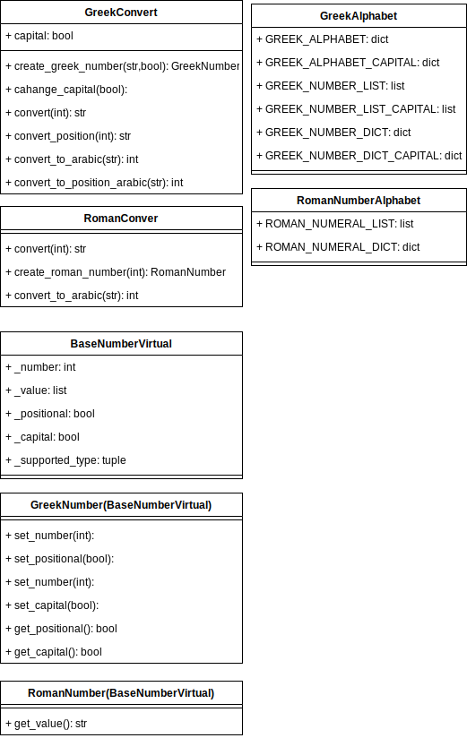

# Модуль преобразование арабских цифр в греческие и римские числа

## Описание

Библиотека преобразует арабские числа, такие как `1234`, в римские эквиваленты, например, `MCCXXXIV`, или греческие — `Α_ΣΛΔ`.

Также этот модуль может выводить греческие цифры в разных форматах. Например, число `20005003001` можно представить как `Κ___Ε__Γ_Α` или `Κ~Ε~Γ~Α`. Кроме того, есть возможность выводить текстовое название цифр, например, `Kappa macron Epsilon macron Gamma macron Alpha`, или выводить их в нижнем регистре.  

## Структура пректа

Есть два основных класса: `GreekConvert` и `RomanConvert`. Они реализуют логику преобразования в соответствующие числа. Также есть классы `GreekAlphabet` и `RomanNumberAlphabet`, которые используются для хранения списков и словарей.  
Есть собственные типы данных `GreekNumber` и `RomanNumber` для работы с греческими и римскими числами, что позволит выполнять с ними базовые математические операции.

## Основные функции

**Для «GreekConvert»:**

- `change_capital`: флаг, управляющий преобразованием символов в верхний или нижний регистр.
- `create_greek_number`: создает класс `GreekNumber`
- `convert` — функция преобразования арабского числа в греческое, например, число `20005003001` преобразуется в `Κ___Ε__Γ_Α`.
- `convert_position` — функция преобразования арабского числа в греческое в соответствии с заданным шаблоном, например, число `20005003001` преобразуется в `Κ~Ε~Γ~Α`.
- `convert_to_arabic` — функция преобразования греческого числа в арабское.
- `covert_to_position_arabic` — эта функция используется в сочетании с `convert_position` и преобразует греческое число в арабское.
- `unicode_to_name` — функция преобразует символ Unicode в его название.
- `name_to_unicode` — обратная операция для `unicode_to_name`.

**Класс «GreekNumber»:**

- `set_number`: установить новое значение
- `set_positional`: установить флаг вывода числа
- `set_capital`: установить флаг верхниго регистра
- `get_number`: получить нынешнее число
- `get_positional`: получить значение флага
- `get_capital`: получить значение флага
- И базывые математические операции

**Для «RomanConvert»:**

- `create_roman_number`: создает класс `RomanNumber`
- `convert` — метод преобразует арабское число в римское.
- `convert_to_arabic` — обратный метод для `convert`.

**Для «RomanNumber»:**

- `set_number`: установить новое значение
- `get_number`: получить нынешнее число
- И базывые математические операции

**Схема пректа**  

## License
Apache License 2.0